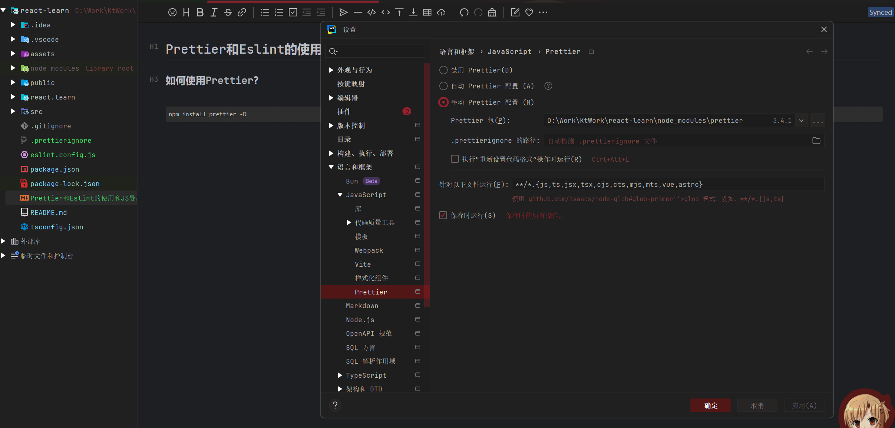
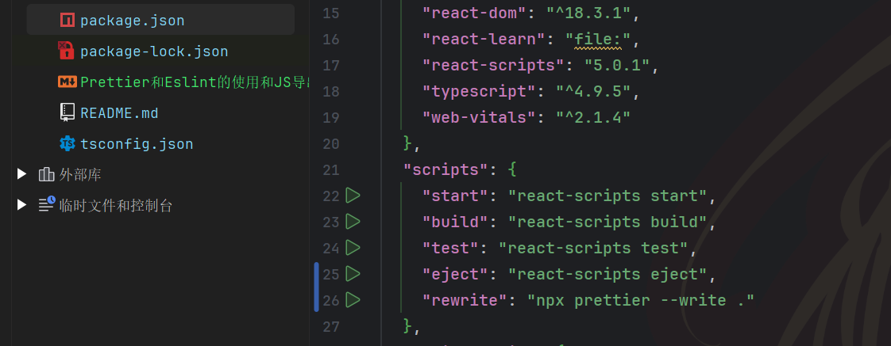

# Prettier和Eslint的使用和JS导出不同的特点

### 如何使用Prettier？

##### 下载

```bash
npm install prettier -D
```



在这里指定prettier的执行目录。

##### 指定忽略文件：

在项目文件夹下面新建文件：

```
.prettierignore
```

写入下面的内容：

```js
# Ignore artifacts:
.vscode
.idea
coverage
node_modules
```

执行下面的命令：

```bash
npx prettier --write .
```



### 如何使用Eslint？

Lint是作为检查代码中可能存在的错误和违规写法而存在的，使用Lint工具可以使得代码中的错误被检查出来。

下载：

```bash
npm i eslint prettier -g 
```

新建文件：

```
eslint.config.js
```

写入下面的内容：

```js
//项目使用eslint进行语法检查
module.exports = {
  rules: {
    semi: "error",
    "prefer-const": "error",
  },
};

```

### JS导入导出的差异：

项目中的 package.json 中 type:"commonjs"，则应该使用 module.exports 的方式导出配置。

也就是写成：

```js
export default [
    {
        rules: {
            semi: "error",
            "prefer-const": "error"
        }
    }
];
```
